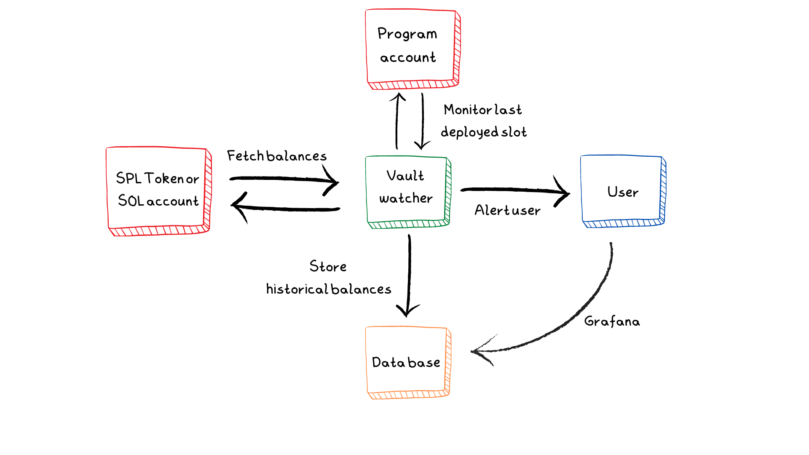
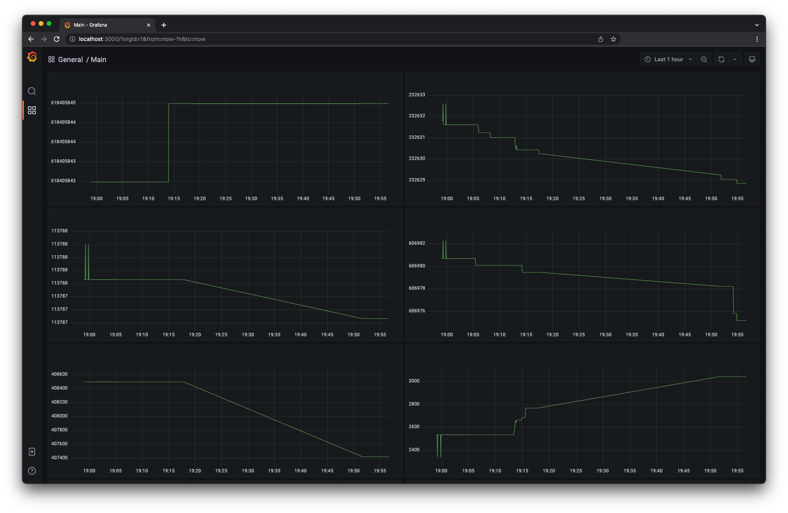

<h1 align="center">Vault watcher</h1>
<br />
<p align="center">

</p>
<p align="center">
<a href="https://twitter.com/bonfida">

</a>
</p>

<br />

<h2 align="center">Monitoring critical spl-token accounts in real time</h2>
<br/>

<div align="center">


</div>

<br />
<h2 align="center">Table of contents</h2>
<br />

1. [Introduction](#introduction)
2. [Usage](#usage)
3. [Configuration](#configuration)
4. [Configuration examples](#configuration-examples)
5. [Grafana](#grafana)

<br />

<p align="center">

</p>
<br />

<br />
<a name="introduction"></a>
<h2 align="center">Introduction</h2>
<br />

This security utility can be deployed as a container on a server to enable the monitoring of mission-critical native sol, spl-token and program accounts. Thanks to compatibility with Slack notifications, it constitutes the basis for a simple early warning system able to detect suspicious variations in account balances and deployments. As such, it can help detect critical bugs in production systems, as well as intentional attacks resulting from contract exploits, key theft, rogue agents/teams, etc.

<br />
<a name="usage"></a>
<h2 align="center">Usage</h2>
<br />

Although the `vault-watcher` service can be used directly as a binary with a custom postgres instance, we recommend using `docker-compose`.

```bash
git clone git@github.com:Bonfida/vault-watcher.git
cd vault-watcher
cp _accounts.json accounts.json
cp _config.json config.json
cp _.env .env
```

The `accounts.json` and `config.json` should then be edited to configure the service. Optionally, the `.env` file can be edited as well. Once this is done, we start the docker containers.

```bash
sudo docker-compose build
sudo docker-compose up
```

The Postgres database can be directly accessed. In addition, a grafana instance with a simple provisioned dashboard can be found running at `http://localhost:3000` by default.

<br />
<a name="configuration"></a>
<h2 align="center">Configuration</h2>
<br />

### `config.json`

| Field Name    | Type    | Description                                                                          |
| ------------- | ------- | ------------------------------------------------------------------------------------ |
| endpoint      | string  | URL for the Solana RPC endpoint to connect to                                        |
| refreshPeriod | integer | Period between account polls in milliseconds. All polls are written to the database. |

### `accounts.json`

An array of accounts objects containing

| Field Name      | Type               | Description                                                                                                                                                    |
| --------------- | ------------------ | -------------------------------------------------------------------------------------------------------------------------------------------------------------- |
| name            | string             | User-readable identifier for the account to monitor. Maximum length is 50 characters.                                                                          |
| address         | string             | The public key in base58 format for the account to monitor                                                                                                     |
| maxChange       | float (Optional)   | The maximum allowable amplitude of balance change (in UiAmount, or Sol for native sol accounts). Only to be specified for a vault account                      |
| maxChangePeriod | integer (Optional) | Maximum number of milliseconds over which a maxChange balance variation is allowed without triggering a notification. Only to be specified for a vault account |

### `.env`

The .env file is used to define additional configuration through environment variables.

| Var name          | Description                                                           |
| ----------------- | --------------------------------------------------------------------- |
| POSTGRES_PASSWORD | Password for direct access to the underlying balance history database |
| DB_PORT           | Port number for the accessible locahost postgres database             |
| GRAFANA_PORT      | Port number on localhost for the grafana interface                    |
| SLACK_URL         | Slack hook url used to push balance notifications to a Slack channel  |

<br />
<a name="configuration-examples"></a>
<h2 align="center">Configuration examples</h2>
<br />

For example, if your endpoint is `https://solana-api.projectserum.com` and you want to poll data every `5s`:

```json
{
  "refreshPeriod": 5000,
  "endpoint": "https://solana-api.projectserum.com"
}
```

For example if you want to monitor `2Av1qmnqjLcnA9cpNduUL9BQcitobBq1Fiu7ZA4t45a6` and allow a max variation of `1,000` tokens every `5s` while monitoring the program account `6XmmYz2gxHRPzh4yUZKiqkifEMbscS2k2ZC3bj6Amdpp`:

```json
{
  "accountType": "vault",
  "address": "2Av1qmnqjLcnA9cpNduUL9BQcitobBq1Fiu7ZA4t45a6",
  "maxChange": 1000,
  "maxChangePeriod": 5000,
  "name": "My token (or native sol) account"
},
{
  "accountType": "program",
  "address": "6XmmYz2gxHRPzh4yUZKiqkifEMbscS2k2ZC3bj6Amdpp",
  "name": "My program account"
}
```

<br />
<a name="grafana"></a>
<h2 align="center">Grafana </h2>
<br />

Historical balances can be monitored using [Grafana](https://grafana.com/) through port `3000`

<p align="center">

</p>
